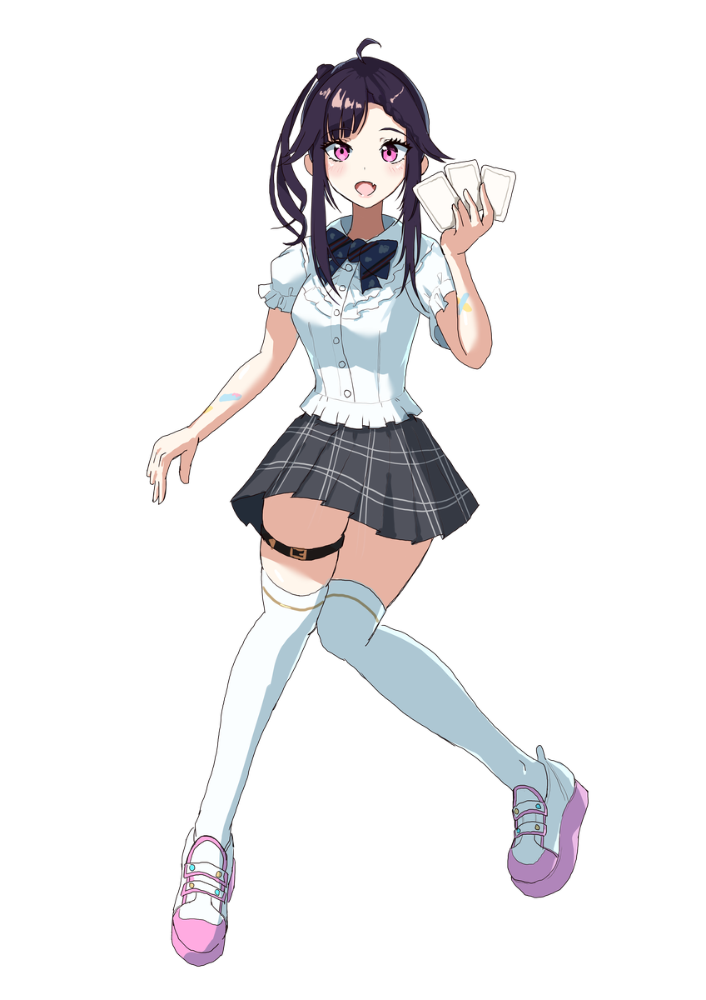

<h1 align="center">Vayria</h1>

  
  
  

<table>
  <tr>
    <td width="40%" align="center" valign="middle">
      
    </td>
    <td width="60%" valign="middle">
      
Vayria（ヴェイリア）は、会話やカードの交換に、声・表情・動きで応えるAIキャラクターです。

      
「AIだけでキャラクターが成立するのか知りたい」と思って作っています。

      
会話ができることと、キャラクターとして成立することは、どこまで同じなんだろう。

      
そこを実際に作って確かめたい、という感じです。

    </td>
  </tr>
</table>

## 今できること

声や文字で話しかけると、Vayriaが音声と表情で応えます。
マイクを使わず、文字やカードだけでもやり取りできます。

カードは、手札とVayriaの「脳内」から1枚ずつ選んで交換します。
交換したカードは次の返答に影響するので、話しかける以外にも反応を変える方法があります。
返答にどのカードが作用したかは、画面で確認できます。

## 試していること

確かめたいのは、返答の内容だけではありません。
話し始めるまでの間や、声と表情、動きも含めて、キャラクターとしてどう感じられるかを見ています。
カードを交換したときも、言葉と振る舞いの両方を見ながら調整しています。

これでキャラクターが成立した、と言えるところまで来たかは、まだ考えているところです。
そもそも何をもって「成立した」とするのか。そこも含めて試しています。

## 公式サイト

[**Vayria — vayria.me**](https://vayria.me/)

ブラウザーで利用する公開版を開発しています。
サイトの公開状況と、ここに記載した機能の提供状況は異なる場合があります。

## 開発と資料

- [開発・運用ガイド](docs/development-guide.md) — セットアップ、音声、モーション、検証の手順
- [Performer Runtimeの設計](docs/architecture/performer-runtime.md) — キャラクターの振る舞いを支える構成
- [検証URLの移行](docs/staging-url-migration.md) — `/staging/` への移行手順（未配信）
- [一般公開版の運用](docs/public-deployment.md) — 公開版の構成と管理
- [展示当日の案内](docs/exhibition-quickstart.md) — 展示での起動、参加者交代、復旧
- [展示準備台帳](docs/exhibition-readiness.md) — 比較・検証と準備の記録
